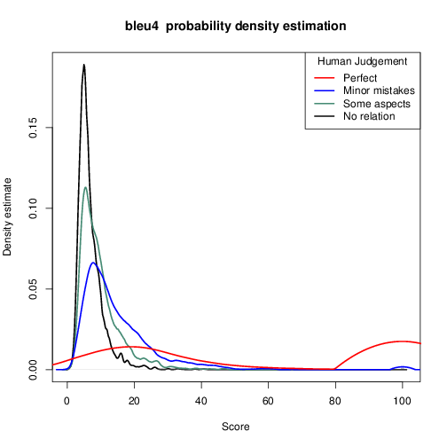
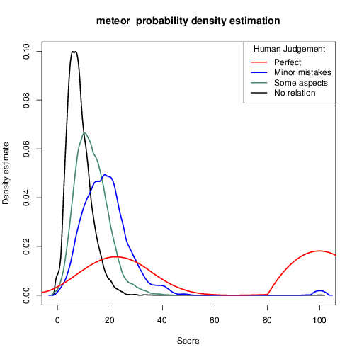

Comparing Image Description Measures
============================

Estimate the correlation of different text-based evaluation measures for
Automatic Image Description. This is the code used in [Elliott and Keller
(2014)](http://aclweb.org/anthology/P/P14/P14-2074.pdf). We repackage the
descriptions and judgements from [Hodosh et al.
(2013)](http://www.jair.org/papers/paper3994.html), and include several other
packages to ease calculations of the co-efficients. The code calculates the
co-efficients for BLEU4, TER, Meteor, and ROUGE-SU4 using the Flickr8K corpus.
However, this can be extended to any sentence-level evaluation measure and any
corpus.

Depends on:

  * Python 2.7+
  * R 3.1.2+
  * Java 1.6+
  * [Multeval](http://www.cs.cmu.edu/~jhclark/downloads/multeval-0.5.1.tgz)
  * [ROUGE 1.5.5](http://www.berouge.com)
  * [PythonRouge](https://github.com/miguelbalmeida/PythonROUGE)
  * Perl and the XML.DOM library

Assumptions
-----------

You have candidate descriptions `$cand`, multiple reference descriptions
`$ref-1`, `$ref-2`, ... and human judgements stored in a common directory
`$data`.

Pre-processing descriptions
---------------------------

In our ACL'14 paper, we performed no tokenization. It is likely that you could
increase the correlation co-efficients if you perform these steps but it may
lead to reproduction errors.

0. **(Optional) Tokenise the text**. Run `python ptbtokenizer $file` in the
   `tokenizer` directory. `$file` is the path to the original file. We use the
   exact tokenizer available in the Stanford Core NLP package.

1. **Split the text files into one file per description.** Run `python
   prepareROUGECandidates.py $cand`, to split the candidates into individual files.
   Run `python prepareROUGEReferences.py $ref{1,2,...}` to split the references
   into individual files.  You need to do this for the ROUGE-SU4 calculations. 

Calculating text-based measures
-------------------------------

1. **Calculate the Smoothed BLEU4, TER, and Meteor scores** Run `./multeval.sh
   eval --refs ../$data/$ref-* --hyps-baseline ../$data/candidates
--meteor.language en --sentLevelDir ../$data/sentLevel` from the `multeval`
directory. *Note*, the `multeval.sh` script downloads the METEOR paraphrase
dictionaries on the first run, which may take a while.

2. **Calculate the ROUGE-SU4 scores** Run `./rougeScores.sh
   $data/perline-candidates $data/perline-ref-0 5` directory.

Calculating correlation co-efficients
-------------------------------------

1. **Extract the Smoothed BLEU4, TER, and METEOR scores from the sys1.opt1
file.** Run `python extractMultEvalScores.py $data/sentLevel/sys1.opt1`, where
`$data` is the path to the descriptions data.

2. **Extract the ROUGE-SU4 scores from the ``ROUGE_result`` directory.** Run `python
extractROUGEScores.py`. This extracts the ROUGE-SU4 recall scores for each candidate
into ROUGE_result/rougeScores.

2. **Append the ROUGE scores to the Multeval scores**. Run `python
appendNewScores.py $newScoresFile $label $data/sentLevel/sys1.opt1`, where
`$newScoresFile$ contains one number perline for each candidate sentence, and
`$label` is a human-readable label for the number.

3. **Calculate the correlations and plot the score distributions**. Run
`Rscript calculateCorrelation.R $scoresFile $judgementsFile`.

Comparison of different measures
-----------------------

We used the Flickr8K data set, expert human judgements, tokenized the text with Stanford
CoreNLP PennTreebank Tokenizer with COCO custom punctuation removals. Note, this table
is slightly different from our ACL paper because here we tokenized the text and include
the recently proposed [CIDEr measure](http://arxiv.org/abs/1411.5726).

|           | Spearman's rho |
| --------- | -------------- |
| CIDEr     | 0.581          |
| Meteor    | 0.560          |
| BLEU4     | 0.459          |
| ROUGE-SU4 | 0.440          |
| TER       | -0.290         |

Visualisating the distribution of scores
----------------------------------------

Visualising the probability density estimates for evaluation measures can offer
additional insight into the differences between measures. In the density 
visualisations below, we can see that BLEU4 struggles to separate three of the 
four classes of human judgements. Meteor does a much better job of separating
descriptions that are Not Related from descriptions that have Minor Mistakes.

